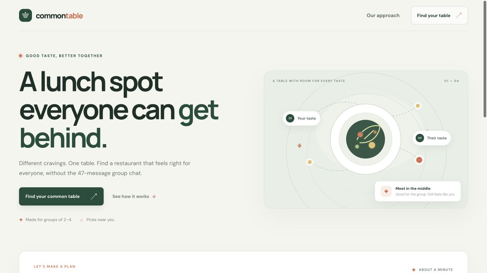
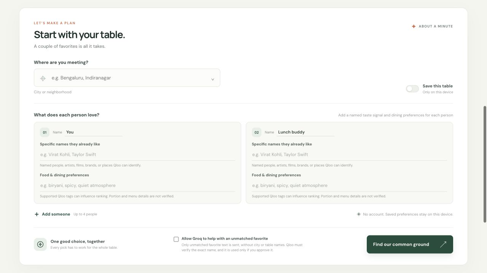
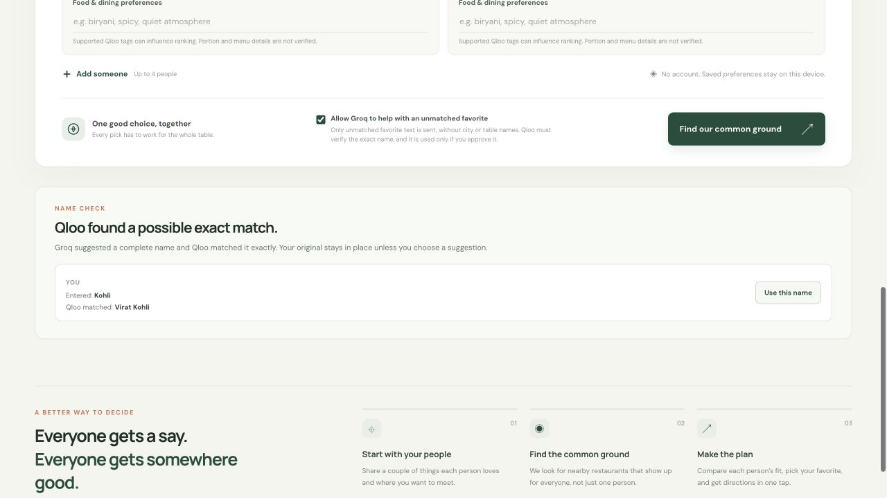
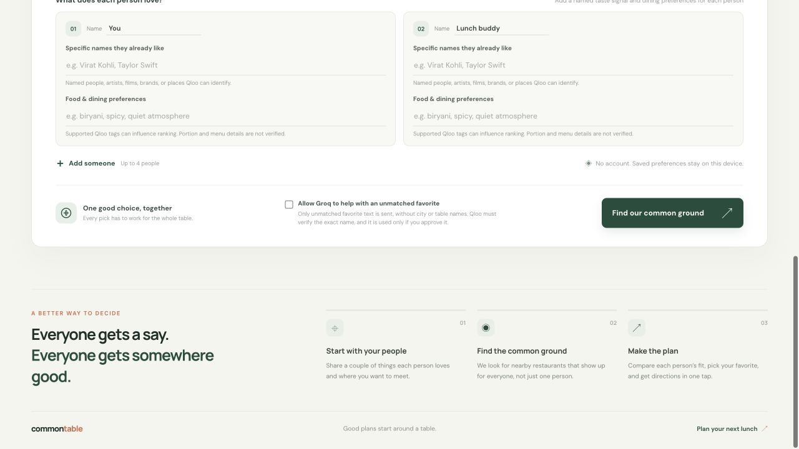
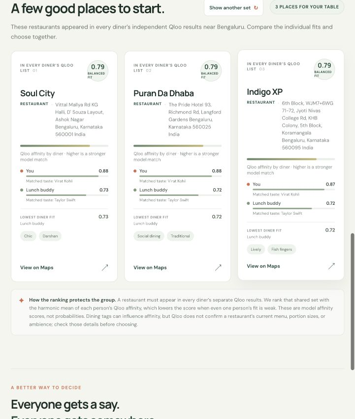

# Common Table

**Lunch your whole table can say yes to.** Common Table turns the daily “where should we eat?” thread into a fair, taste-aware group decision. Each person gets a separate Qloo Taste AI recommendation query. Only restaurants present in every person's Qloo results are eligible, and a harmonic mean of their Qloo affinities ranks the fairest overlap first.

Common Table is a web app and an MCP tool for the Qloo Agentic Hackathon. It is designed for recurring team lunches: remember a table's names and taste anchors on one device, refresh the shared shortlist, and open a name-and-address-based map search. It does not claim that a venue is open, bookable, or suitable for dietary needs; verify those details with the restaurant.

## How the group ranking works

1. Each of two to four diners adds named cultural favorites. Optional food and dining preferences are handled separately.
2. Common Table resolves each person's anchors through Qloo Search and requests Qloo Insights independently for each diner.
3. It intersects the returned Qloo restaurant entity IDs. A pick must appear in every person's result set.
4. It ranks the shared venues by the harmonic mean of those individual Qloo affinities, so one high score cannot hide a weaker fit for someone else.
5. It shows per-diner affinity, the lowest individual fit, matched taste signals, and useful Qloo tags when available. Affinity is a model score, not a probability.
6. “Show another set” excludes the current places. Maps searches the exact venue name and address instead of trusting an unverified third-party website field.

## Optional, consent-based Groq name help

The planner's **“Allow Groq to help with an unmatched favorite”** checkbox is unchecked by default. Groq is used only when the user opts in and Qloo has not resolved another named anchor for that diner. Common Table sends Groq only the unresolved favorite text, without the city or table member names, and asks for at most one possible full name per input.

Qloo must verify the candidate as an exact entity match. The web app shows the original and matched name; choosing **“Use this name”** is required before it is applied and the plan runs. If the user does not opt in, Groq is not called. Groq does not generate restaurant recommendations, alter dining preferences, or bypass Qloo errors and rate limits.

Set `GROQ_API_KEY` on the server to enable this option. The default model is `openai/gpt-oss-20b`; set `GROQ_MODEL` to override it. Without a Groq key, standard Qloo planning still works.

## Run locally

Use Node.js 20.6 or newer. Copy `.env.example` to `.env`, set `QLOO_API_KEY` to your private hackathon key, and start the app:

```sh
cp .env.example .env
npm start
```

Open `http://localhost:3000`. The Qloo key stays on the server and is never sent to browser code. The table profile is stored in browser local storage only when “Save this table” is enabled. Without a Qloo key, the planner shows a preview state instead of fabricated recommendations.

## Agent interface

The app exposes a Model Context Protocol Streamable HTTP endpoint at:

```text
https://tastetrail-qloo-hackathon.vercel.app/api/mcp
```

Tool: **`find_shared_lunch`** — accepts a city and two to four participants. Each participant has a name, one to three `favorites`, and optional `diningPreferences`. It returns shared Qloo-ranked restaurants, individual affinities, useful tags, and name/address-based Google Maps search URLs.

The MCP server implements `initialize`, `ping`, `tools/list`, and `tools/call` over JSON-RPC 2.0 POST requests. Clients should send an `Accept` header containing `application/json, text/event-stream`.

Optional argument `allowGroqAssist` must be set to `true` only after the user opts in. If the tool returns `needsConfirmation` with a Qloo-verified name, show the candidate and wait for the user's approval before using that name in a plan.

Example MCP `tools/call` arguments:

```json
{
  "city": "Bengaluru",
  "participants": [
    { "name": "You", "favorites": ["Virat Kohli"] },
    { "name": "Lunch buddy", "favorites": ["Taylor Swift"] }
  ],
  "allowGroqAssist": false
}
```

The web interface calls `POST /api/plan` with the same planning fields and optional `excludeIds` when someone asks for another set. City suggestions are provided by `GET /api/cities?q=...`.

## Qloo integration and architecture

- Accessible, responsive HTML, CSS, and browser JavaScript interface.
- Dependency-free Node.js HTTP server for static files, request validation, rate limiting, Qloo calls, and MCP.
- Qloo `/search` resolves supported people, artists, films, brands, and places; `/v2/insights` runs once per participant with restaurant category, locality, and explainability filters.
- `QLOO_API_KEY` and optional `GROQ_API_KEY` are server-side environment variables. `.env` is ignored by Git. Never put either key in browser code or commit it.
- MIT license.

## Screenshots from the current production UI

Captured from the public production site on October 9, 2026. The live-results and name-review examples use generic diner labels.











## Public links

- Live demo: https://tastetrail-qloo-hackathon.vercel.app/
- Source: https://github.com/doradlaharikrishna/tastetrail-qloo-hackathon
- [Project thumbnail](screenshots/common-table-thumbnail.png)

## Verification

Run the automated tests and syntax checks from this directory:

```sh
npm test
node --check server.js
node --check app.js
git diff --check
```

The fixture tests cover Qloo anchor handling, Groq opt-in, Qloo validation of a suggested name, and the opt-out path. With valid server-side keys configured, try a two-person plan in different cities and with distinct taste anchors. Confirm that every returned venue appears in each person's Qloo result set, shows separate affinities, and opens a Google Maps search containing the venue name and address. API availability and rate limits are controlled by Qloo.
